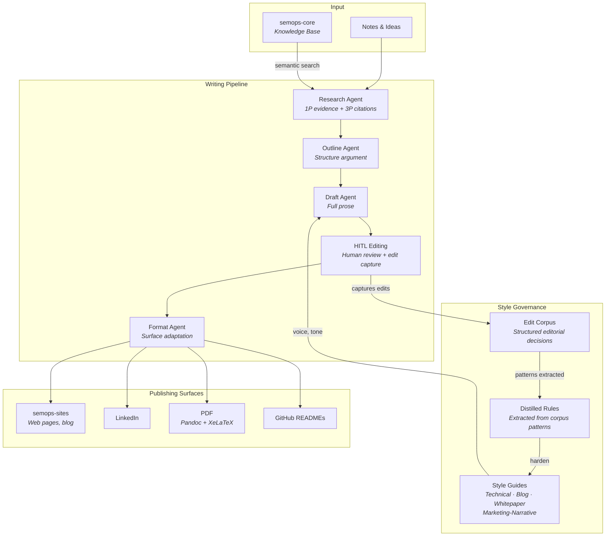

# semops-publisher

The content creation and publishing system for the [SemOps](https://semops.ai) organization, combining AI writing agents, style governance across content types, and a feedback loop that captures human editorial decisions as structured training data.

## What This Is

The SemOps system has three layers: a domain-agnostic core engine ([semops-core](https://github.com/semops-ai/semops-core), [semops-data](https://github.com/semops-ai/semops-data), [semops-dx-orchestrator](https://github.com/semops-ai/semops-dx-orchestrator)), domain applications built on that engine, and agentic operations. This repo is the first domain application: a [Digital Asset Management](https://en.wikipedia.org/wiki/Digital_asset_management) (DAM) and publishing system that uses the core engine's schema, knowledge base, and coherence measurement to create content across multiple surfaces. It is how SemOps demonstrates its own framework by applying it to real publishing workflows.

AI writing agents handle research, outlining, drafting, and formatting across blog posts, website pages, whitepapers, LinkedIn, GitHub READMEs, and PDFs, with human editorial control at each stage. The editorial process itself is captured as structured data, creating a feedback loop between human judgment and AI output.

The system has three main components:

1. **AI-assisted writing pipeline.** A staged workflow where agents handle research, outlining, drafting, and formatting, with human review at each stage. The pipeline queries the [semops-core](https://github.com/semops-ai/semops-core) knowledge base for first-party evidence and domain context, so content is grounded in the system's own knowledge graph rather than relying on the AI model's general training alone.
2. **Style governance.** Four style guides (technical, blog, whitepaper, marketing-narrative) define voice, tone, and formatting conventions for different content types and audiences. Style guides are living documents that evolve based on patterns extracted from the edit capture corpus.
3. **Edit capture for style learning.** Every editorial change made during human-in-the-loop (HITL) refinement is logged with intent metadata: what changed, why, and which style rule was applied. This is a simple session-based agentic process: while editing, the agent logs each change as structured YAML alongside the content work. The resulting corpus can be analyzed to extract patterns and harden style guides today, and is designed from the start to serve as fine-tuning data for a custom model that learns the editorial voice over time.

Each content type has its own workflow, but all share the same contract: finished content is Markdown with embedded YAML frontmatter (the [content manifest](https://github.com/semops-ai/semops-dx-orchestrator)) that defines metadata, style, audience tier, and publishing surface.

This repo and [semops-sites](https://github.com/semops-ai/semops-sites) together form the two halves of the DAM pipeline. Publisher owns the creation side: editorial voice, style governance, content quality, and the writing agents that produce artifacts. Sites owns the delivery side: MDX transforms, routing, design system, and the web surfaces where content is rendered. The content manifest is the contract between them. Publisher produces clean Markdown with content-level metadata; Sites handles everything from that point forward (layout, components, SEO, deployment). Neither repo needs to understand the other's internals, but they co-evolve as a [Partnership](https://github.com/semops-ai/semops-dx-orchestrator#how-repos-integrate): shared artifacts like fonts, PDF templates, and content schemas are coordinated across both. Other surfaces (LinkedIn, PDF, GitHub) bypass Sites entirely and use direct export from Publisher.

Part of the [semops-ai](https://github.com/semops-ai) organization. For system-level architecture and how all six repos relate, see [semops-dx-orchestrator](https://github.com/semops-ai/semops-dx-orchestrator).

**What this repo is NOT:**

- Not a CMS or publishing platform — it creates content, it does not host or serve it
- Not a general-purpose writing tool — the agents and style guides are tuned for SemOps content
- Not concept documentation (see [semops-docs](https://github.com/semops-ai/semops-docs) for framework theory)

## How to Read This Repo

**If you want to understand the content creation workflow:**
Start with [What This Is](#what-this-is) for the overall system, then see [Writing Pipeline](#writing-pipeline) for how content moves from notes to published artifact.

**If you want to understand the style learning system:**
The [Style Learning](#style-learning) section explains how edit capture, corpus review, and rule distillation create a feedback loop between human editing and AI writing.

**If you want to study the architecture and design decisions:**
The [Key Decisions](#key-decisions) section explains why there are multiple style guides, why editorial edits are captured as structured data, and why the content manifest exists.

**If you're coming from the orchestrator and want implementation depth:**
This repo implements the Publishing Pipeline, Agentic Composition, and Style Learning capabilities described in [semops-dx-orchestrator](https://github.com/semops-ai/semops-dx-orchestrator#repo-map). It consumes knowledge base services from [semops-core](https://github.com/semops-ai/semops-core) and supplies content to [semops-sites](https://github.com/semops-ai/semops-sites).

## Architecture



The writing pipeline is agent-assisted but human-controlled. AI handles the labor-intensive stages (research synthesis, outlining, prose generation, format adaptation), while humans make editorial decisions at each review point. The style learning loop means the system improves over time — patterns from human edits are extracted into rules that feed back into the style guides that govern future AI output.

## Writing Pipeline

### Blog Posts

The most developed workflow, with four agent stages and human review:

```
notes.md → Research Agent → research.md → Outline Agent → outline_vN.md
    → Draft Agent → draft.md → HITL Editing → final.md → Format Agent → linkedin.md
```

The Research Agent queries the [semops-core](https://github.com/semops-ai/semops-core) knowledge base for first-party evidence (concepts, patterns, entities from the domain model) and identifies third-party sources for external citations. Output is a structured research document with 1P and 3P sections, coverage gaps, and suggested angles.

### Website Pages

Hub/spoke document structures for interconnected content (e.g., a "What is SemOps?" hub with "Why SemOps?" and "How I Got Here" spokes). Pages are co-located in the same directory, use relative links between siblings, and follow the marketing-narrative style guide.

### Whitepapers

Long-form thought leadership exported as PDFs via [Pandoc](https://pandoc.org/) and XeLaTeX with custom templates (per-brand typography: DM Sans for consulting, Inter for personal brand). Working drafts iterate through the writing pipeline before moving to the final content directory.

### LinkedIn and GitHub READMEs

LinkedIn posts are either blog-derived (Format Agent) or standalone drafts. GitHub READMEs (like this one) are drafted with the marketing-narrative style guide and manually copied to target repos.

## Style Learning

The style learning system is a feedback loop between human editorial judgment and AI writing:

```
AI generates content → Human edits with intent → Edits captured as YAML
    → Corpus reviewed for patterns → Rules distilled → Style guides hardened
    → AI generates better content next time
```

### Edit Capture

During HITL editing, every change is logged as a structured YAML record: the original text, the edited text, the reason for the change, and the style rule applied (if any). Edits can be flagged when the rationale is uncertain or represents a new pattern. Two capture paths exist: agent-side logging (real-time, during editing sessions) and diff-based capture (post-hoc, comparing AI draft to human-edited version).

### Corpus Review and Rule Distillation

The edit corpus is periodically analyzed to extract recurring patterns — a specific framing that's always corrected, a sentence structure that's consistently simplified, a tone shift that's applied across documents. These patterns are distilled into rules with frequency counts and source attribution, then optionally promoted to the style guides themselves.

### Style Guides

Four guides govern different content types:

| Guide | Use For | Voice |
| ----- | ------- | ----- |
| Technical | Documentation, architecture docs | Objective, mechanism-first |
| Blog | Blog posts, social content | Conversational, hook-driven |
| Whitepaper | Thought leadership, research | Authoritative, evidence-backed |
| Marketing-Narrative | Web pages, framework overviews, READMEs | Founder-practitioner, SCQ-A arc |

Each guide defines audience tiers (accessible, technical, mixed) with different jargon tolerance and explanation depth. The marketing-narrative guide, for example, uses a founder-practitioner voice that combines personal conviction with analytical rigor — distinct from the blog guide's conversational tone.

## Image and Media Generation

AI image and video generation for content assets using a multi-environment architecture:

- **Local GPU.** Interactive development with ComfyUI (Stable Diffusion XL, LoRAs, ControlNets)
- **Cloud GPU.** Batch and heavy workflows via RunPod (AnimateDiff, video generation)
- **External APIs.** Third-party services for specialized generation

Workflows are saved as reproducible JSON configurations. Model storage is centralized on a dedicated drive with tool-native directory structures.

## Key Decisions

### 1. Style Guides Per Content Type

**Decision:** Maintain separate style guides for each content type rather than a single organizational voice.

**Why:** Different publishing surfaces serve different audiences with different expectations. A whitepaper reader expects evidence and authority. A blog reader expects personality and accessibility. A GitHub README reader expects clarity and efficiency. Trying to serve all three with one voice produces content that satisfies none. Four focused guides are more useful than one compromised guide.

**Trade-off:** More governance overhead. Style rules can conflict across guides, and authors must know which guide applies. Mitigated by the content manifest: every piece of content declares its `style_guide` in frontmatter, so there is no ambiguity about which rules apply.

### 2. Edit Capture as Structured Data

**Decision:** Log every HITL editorial change as structured YAML (original, edited, reason, rule, style) rather than relying on git diffs alone.

**Why:** Git diffs show *what* changed but not *why*. A correction from passive to active voice looks the same as fixing a factual error in a diff. By capturing intent metadata alongside each edit, the system builds a corpus that can be analyzed for patterns. Recurring corrections reveal gaps in the style guides. Flagged edits surface emerging rules that haven't been codified yet.

**Trade-off:** Friction during editing. Every change requires a reason. This is intentional — it forces conscious editorial decisions rather than instinctive corrections, and the structured output is what makes corpus analysis possible. The system implements [Scale Projection](https://github.com/semops-ai/semops-docs/blob/main/SEMANTIC_OPERATIONS_FRAMEWORK/SEMANTIC_OPTIMIZATION/scale-projection.md): manual HITL processes designed from day one to generate structured data that eventually becomes machine learning training data.

### 3. Content Manifest as Contract

**Decision:** Use embedded YAML frontmatter in Markdown files as the contract between content creation (this repo) and content delivery ([semops-sites](https://github.com/semops-ai/semops-sites)).

**Why:** Publisher owns content creation (voice, style, editorial quality). Sites owns delivery (MDX transforms, routing, design system). The manifest is the boundary between them. Publisher produces clean Markdown with content-level metadata (title, author, style guide, audience tier). Sites adds surface-specific concerns (layout, components, SEO). Neither repo needs to understand the other's internals.

**Trade-off:** Two-repo workflow for web publishing. Content changes require a commit in Publisher and an ingestion step in Sites. This is acceptable because it enforces separation of concerns. The alternative (Publisher generating MDX directly) would couple content creation to frontend implementation details.

## Status

| Component | Maturity | Notes |
| --------- | -------- | ----- |
| Blog writing pipeline | Beta | Research, outline, draft, format agents functional |
| Research agent (KB-powered) | Beta | Queries semops-core knowledge base for 1P evidence |
| Website page workflow | Beta | Hub/spoke structure, marketing-narrative style |
| GitHub README workflow | Beta | Marketing-narrative style, manifest frontmatter |
| Whitepaper workflow | Beta | Pandoc + XeLaTeX export with custom templates |
| LinkedIn workflow | Beta | Blog-derived and standalone paths |
| Style guides | Stable | Four guides (technical, blog, whitepaper, marketing-narrative) |
| Edit capture | Stable | Agent-side and diff-based capture paths operational |
| Corpus review | Beta | Pattern extraction and rule distillation functional |
| Image generation | Beta | ComfyUI local + RunPod cloud, workflow JSON saved |
| Content manifest | Stable | YAML frontmatter contract, five content types |

This is a single-person project in active development. The writing pipeline and style guides are stable and used for all content creation, while the style learning loop and agentic composition capabilities are maturing.

## References

### Related

- **[semops-dx-orchestrator](https://github.com/semops-ai/semops-dx-orchestrator)** — System architecture, cross-repo coordination, and design principles
- **[semops-core](https://github.com/semops-ai/semops-core)** — Schema, knowledge graph, and shared infrastructure services (knowledge base for research)
- **[semops-sites](https://github.com/semops-ai/semops-sites)** — Frontend deployment, content ingestion, design system
- **[semops-docs](https://github.com/semops-ai/semops-docs)** — Framework theory, concepts, and foundational research
- **[semops.ai](https://semops.ai)** — Framework concepts and the case for Semantic Operations
- **[timjmitchell.com](https://timjmitchell.com)** — Blog, thought leadership, and project narrative

### Influences

- **[DAM](https://en.wikipedia.org/wiki/Digital_asset_management)** (Digital Asset Management) — Content lifecycle, metadata governance, multi-surface delivery
- **[Dublin Core](https://www.dublincore.org/)** — Attribution metadata standard used in content manifest
- **[RLHF](https://en.wikipedia.org/wiki/Reinforcement_learning_from_human_feedback)** (Reinforcement Learning from Human Feedback) — Conceptual model for edit capture → style learning loop
- **[SECI](https://en.wikipedia.org/wiki/SECI_model)** (Nonaka) — Knowledge creation model: tacit editorial judgment → explicit style rules
- **[Pandoc](https://pandoc.org/)** — Universal document converter for PDF export

## License

[MIT](LICENSE)
