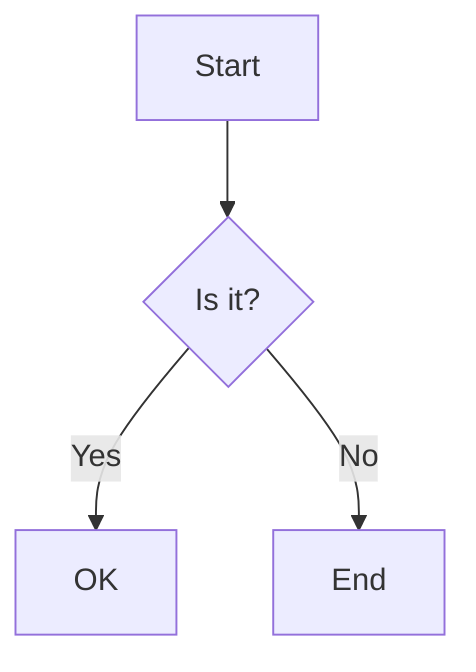
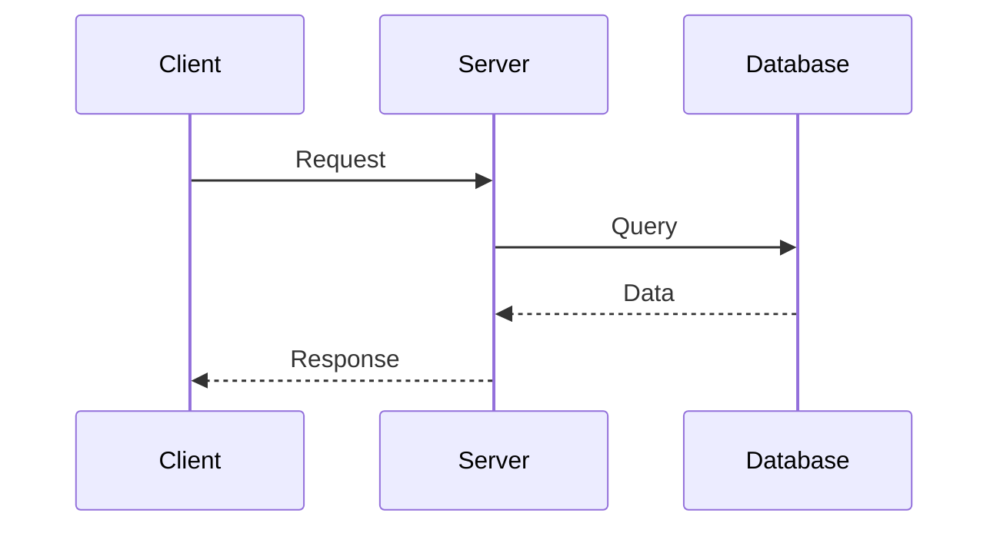
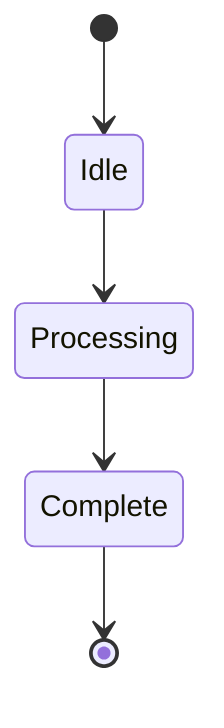
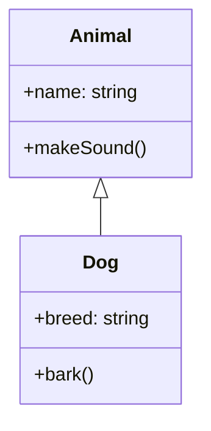
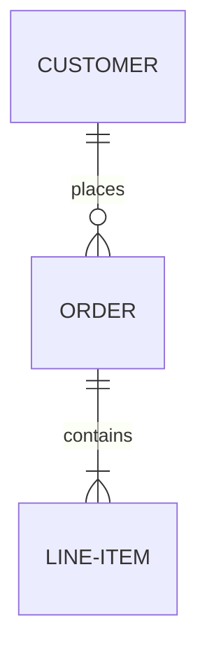
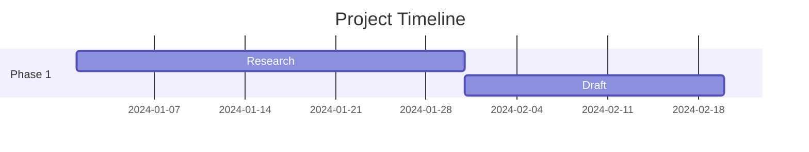

# Diagram Standards - Phase 1

## Overview

Phase 1 uses **Mermaid** and **Excalidraw** for all diagrams. These tools are:
- Version-controllable (text/JSON)
- Renderable in markdown viewers
- Easy to iterate on
- Suitable for technical content

---

## When to Use Each Tool

### Mermaid
**Best for:**
- Flowcharts and process diagrams
- Sequence diagrams (API calls, workflows)
- State diagrams
- Class diagrams (architecture)
- Gantt charts (timelines)
- Entity relationship diagrams

**Characteristics:**
- Clean, professional look
- Automatically laid out
- Easy to maintain
- Great for technical accuracy

**Example use cases:**
- System architecture diagrams
- Data flow diagrams
- API interaction sequences
- State machines
- Decision trees

### Excalidraw
**Best for:**
- Concept illustrations
- Hand-drawn style diagrams
- Whiteboard-style explanations
- Less formal visualizations
- Annotations and callouts

**Characteristics:**
- Hand-drawn, friendly aesthetic
- Manual layout control
- Good for storytelling
- More approachable/accessible

**Example use cases:**
- Explaining concepts to non-technical audiences
- Sketching ideas and relationships
- Annotated screenshots
- Collaborative design mockups
- Hero/featured images with diagrams

---

## Diagram Specification Format

When agents suggest diagrams in outlines or drafts, use this format:

### Mermaid Diagrams

```markdown
### Diagram: [Name]
**Type:** Mermaid [flowchart/sequence/state/class/etc.]
**Purpose:** [What this diagram explains]
**Location:** `assets/[filename].mermaid`

**Suggested Content:**
\`\`\`mermaid
graph TD
    A[Start] --> B{Decision}
    B -->|Yes| C[Action 1]
    B -->|No| D[Action 2]
\`\`\`

**Rendering:**
- Export as PNG: `assets/[filename].png`
- Alt text: "[Accessible description]"
```

### Excalidraw Diagrams

```markdown
### Diagram: [Name]
**Type:** Excalidraw sketch
**Purpose:** [What this diagram explains]
**Location:** `assets/[filename].excalidraw`

**Elements to include:**
- [Element 1: description]
- [Element 2: description]
- Arrows showing: [relationship]
- Annotations: [key callouts]

**Style:**
- Hand-drawn look
- Color scheme: [colors to use]
- Emphasis on: [what to highlight]

**Rendering:**
- Export as PNG: `assets/[filename].png`
- Export as SVG: `assets/[filename].svg` (for web)
- Alt text: "[Accessible description]"
```

---

## Mermaid Diagram Types Reference

### Flowchart


**Use for:** Process flows, decision trees, workflows

### Sequence Diagram


**Use for:** API interactions, message flows, temporal sequences

### State Diagram


**Use for:** System states, FSMs, status transitions

### Class Diagram


**Use for:** Software architecture, object models, relationships

### Entity Relationship


**Use for:** Database schemas, data models

### Gantt Chart


**Use for:** Project timelines, milestones

---

## Excalidraw Best Practices

### File Organization
```
assets/
  diagram-name.excalidraw      # Source file (JSON)
  diagram-name.png             # Rendered raster
  diagram-name.svg             # Rendered vector
```

### Style Guidelines

**Colors:**
- Use consistent palette across diagrams
- Suggestion: Limit to 3-4 colors per diagram
- Consider colorblind accessibility

**Text:**
- Keep labels concise
- Use consistent font sizes
- Ensure readability at publish size

**Layout:**
- Left-to-right or top-to-bottom flow
- Group related elements
- Use whitespace effectively

**Arrows:**
- Consistent arrow styles for same meaning
- Label arrows when necessary
- Avoid crossing arrows when possible

### Export Settings

**For Web:**
- PNG at 2x resolution (retina)
- Max width: 1200px
- Compress for web (TinyPNG or similar)

**For LinkedIn:**
- PNG at 1200x628 (optimal LinkedIn image size)
- Or 1200x1200 for square posts

---

## Workflow for Creating Diagrams

### Phase 1: Manual Creation

1. **From Agent Specification:**
   - Agent suggests diagram in outline/draft
   - Includes type, purpose, suggested content

2. **Create Source File:**
   ```bash
   # For Mermaid
   # Create .mermaid file in assets/
   # Paste suggested mermaid code

   # For Excalidraw
   # Open https://excalidraw.com
   # Create diagram per spec
   # Export as .excalidraw JSON to assets/
   ```

3. **Render for Publishing:**
   ```bash
   # Mermaid rendering options:
   # - VS Code Mermaid extension (preview + export)
   # - mermaid-cli: mmdc -i input.mermaid -o output.png
   # - GitHub/GitLab markdown rendering

   # Excalidraw rendering:
   # - Export PNG from excalidraw.com
   # - Or use excalidraw-cli
   # - Export both PNG and SVG
   ```

4. **Add to Post:**
   ```markdown
   
   *Caption explaining what the diagram shows*
   ```

### Phase 2+: Potential Automation

Future options to consider:
- Auto-generate Mermaid from structured data
- LLM-generated Mermaid syntax
- Excalidraw template library
- Automated rendering pipeline
- ComfyUI integration for diagram enhancement

---

## Agent Guidelines

### When Suggesting Diagrams

Agents should consider:
1. **Is a diagram needed?** Don't over-diagram
2. **Which tool is better?** Mermaid for technical, Excalidraw for conceptual
3. **Provide useful spec:** Enough detail to create without guessing
4. **Suggest Mermaid syntax:** For Mermaid diagrams, include starter code
5. **Describe visual elements:** For Excalidraw, describe layout and key elements

### Diagram Suggestion Template

```markdown
## Visual: [Name]

**Type:** Mermaid [type] / Excalidraw sketch
**Purpose:** [One sentence explaining what this shows]
**Why needed:** [Why text alone isn't sufficient]
**Placement:** [Where in the post - intro/middle/summary]

**Specification:**
[Mermaid code OR Excalidraw element description]

**Alt text:** [Accessible description for screen readers]
**Caption:** [Brief caption for post]
```

---

## Examples

### Example 1: Technical Architecture (Mermaid)

```markdown
## Visual: RAG System Architecture

**Type:** Mermaid flowchart
**Purpose:** Show how RAG system components interact
**Why needed:** Architecture has multiple async flows that are hard to explain in text
**Placement:** After introduction, before diving into components

**Specification:**
\`\`\`mermaid
graph LR
    User[User Query] --> Emb[Embedding Model]
    Emb --> Vec[Vector DB]
    Vec --> Ret[Retrieved Docs]
    Ret --> LLM[LLM]
    User --> LLM
    LLM --> Resp[Response]
\`\`\`

**Alt text:** "Flowchart showing RAG system with user query being processed through embedding model, vector database retrieval, and LLM generation"
**Caption:** "RAG system architecture showing the flow from user query to generated response"
```

### Example 2: Concept Explanation (Excalidraw)

```markdown
## Visual: Context Window Analogy

**Type:** Excalidraw sketch
**Purpose:** Explain LLM context window using visual metaphor
**Why needed:** Abstract concept benefits from visual analogy
**Placement:** Early in post when introducing the concept

**Specification:**
Elements to draw:
- Large box labeled "Context Window"
- Smaller boxes inside: "System Prompt", "Conversation History", "Current Input"
- Arrow showing new messages pushing old ones out
- Annotation: "Fixed size - older messages get dropped"
- Use warm colors (orange/yellow) for active context
- Gray for dropped content

Style: Hand-drawn, friendly, whiteboard-like

**Alt text:** "Hand-drawn diagram showing LLM context window as a box with sections for system prompt, history, and current input, with an arrow showing how new content pushes out old content"
**Caption:** "The context window has a fixed size - new messages push out old ones"
```

---

## File Naming Conventions

```
assets/
  # Descriptive, kebab-case names
  user-authentication-flow.mermaid
  user-authentication-flow.png

  concept-context-window.excalidraw
  concept-context-window.png
  concept-context-window.svg

  # Hero images
  hero-main-concept.excalidraw
  hero-main-concept.png
```

---

## Tools & Setup

### Mermaid

**Editors:**
- VS Code Mermaid extension (preview + export)
- Mermaid Live Editor: https://mermaid.live
- GitHub/GitLab native rendering

**CLI (optional for automation):**
```bash
npm install -g @mermaid-js/mermaid-cli
mmdc -i diagram.mermaid -o diagram.png
```

### Excalidraw

**Editor:**
- Web: https://excalidraw.com
- VS Code extension: excalidraw-editor
- Desktop app (optional)

**Libraries:**
- Create custom libraries for recurring elements
- Share libraries across posts for consistency

**Plugins (optional):**
- Excalidraw CLI for automation
- Obsidian Excalidraw plugin (if using Obsidian)

---

## Checklist for Diagram Creation

- [ ] Diagram serves clear purpose (not decorative)
- [ ] Appropriate tool chosen (Mermaid vs Excalidraw)
- [ ] Source file saved in `assets/`
- [ ] Rendered as PNG (and SVG for Excalidraw)
- [ ] Accessible alt text written
- [ ] Caption explains key insight
- [ ] File naming follows convention
- [ ] Readable at typical screen sizes
- [ ] Colors are accessible (contrast, colorblind-friendly)

---

## Phase 1 Learning Goals

As we create diagrams manually, document:
1. **Which types are most common?** (to prioritize automation)
2. **What specs are most helpful?** (to improve agent suggestions)
3. **What takes longest?** (to identify pain points)
4. **Style patterns that emerge** (to create templates)

This will inform Phase 2 automation decisions.
